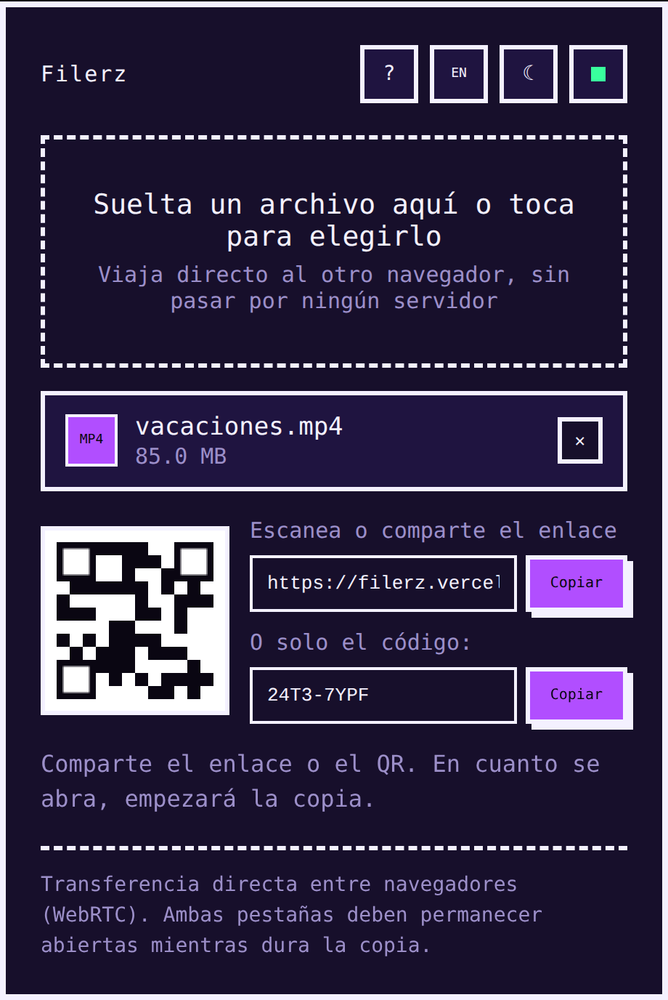

# Filerz

[English](README.en.md) | **Español**

Transferencia de archivos peer-to-peer, al estilo [file.pizza](https://file.pizza): el archivo viaja directo de un navegador a otro por WebRTC, sin subirse nunca a ningún servidor propio.

[](https://vercel.com/new/clone?repository-url=https://github.com/rzazo24/filerz)
[](https://github.com/rzazo24/filerz/actions/workflows/test.yml)



## Qué hace

- El emisor elige un archivo y se genera un **enlace de un solo uso** + un **código QR**. Debajo del enlace hay un campo con solo el código (por ejemplo `ABCD-1234`), para copiarlo o dictarlo cuando el enlace completo es incómodo de compartir, especialmente en pantallas pequeñas.
- Por ahora se envía **un archivo por transferencia** (no hay selección múltiple); para mandar varios, comprímelos en un `.zip` y comparte ese archivo.
- El receptor abre el enlace (o escanea el QR) y la transferencia arranca sola. Si no tiene el enlace a mano, también puede escribir el código directamente en la página o escanear el QR con la cámara del dispositivo, sin salir a una app externa.
- Barra de progreso en ambos lados, con **velocidad y tiempo restante estimado**, mientras dura la copia.
- Botón para **cancelar** la transferencia en cualquier momento y elegir otro archivo. Si el receptor se desconecta a mitad de la copia, se puede reintentar compartiendo el mismo enlace: deja de funcionar recién cuando se completa con éxito.
- Al completarse la transferencia aparece un botón **Recargar** en ambos lados: en el emisor vuelve a la pantalla de elegir archivo, y en el receptor limpia el enlace de la URL antes de recargar, para no reintentar conectarse a un enlace que ya se usó.
- El archivo nunca pasa por un backend: viaja directo entre los dos navegadores por un `RTCDataChannel`.
- **Tema claro/oscuro** con botón dedicado, y drop-zone accesible por teclado.
- Es una **PWA instalable**: se puede agregar a la pantalla de inicio (o instalar como app de escritorio), la interfaz carga al instante gracias al service worker (incluso sin conexión), y avisa con un cartel cuando hay una versión nueva para recargarla.
- Botón de **ayuda** (`?`) con instrucciones de uso y el link a este repositorio.
- Interfaz en **español o inglés**: detecta el idioma del navegador al entrar y se puede cambiar con el botón ES/EN del encabezado (se recuerda en `localStorage`). Los mensajes de error que viajan entre emisor y receptor usan códigos, no texto ya traducido, así que cada lado ve la interfaz en su propio idioma sin importar el del otro.

## Cómo funciona

Todo vive en un único archivo HTML autocontenido (`index.html`), sin paso de build ni dependencias instaladas:

- **[PeerJS](https://peerjs.com/)** envuelve WebRTC y resuelve la señalización inicial (el intercambio de SDP/ICE necesario para que los dos navegadores se encuentren) usando el broker público de **PeerJS Cloud**. Una vez establecida la conexión, los datos ya no pasan por ese broker. En vez del UUID largo que asigna por defecto, se genera un ID propio de 8 caracteres en mayúsculas, separados en dos bloques (`ABCD-1234`), para que el enlace sea más corto y fácil de leer o tipear a mano; se evitan además los caracteres que se prestan a confusión (`0/O/1/I/L`) y el alfabeto es de un solo caso para no tener que adivinar mayúscula/minúscula (con reintento automático si por casualidad coincide con uno ya en uso).
- **[qrcodejs](https://github.com/davidshimjs/qrcodejs)** genera el QR con el enlace de la sesión.
- **[jsQR](https://github.com/cozmo/jsQR)** decodifica QR en vivo desde la cámara (`getUserMedia`) para poder escanear el código de otro dispositivo sin salir de la página. Si la cámara no está disponible o la librería no carga, se avisa con un mensaje y queda la opción de escribir el código a mano.
- El archivo se envía en fragmentos de 16 KB por el canal de datos, con control de flujo para no saturar el buffer de salida. Para archivos de más de 200 MB en navegadores compatibles (Chrome/Edge de escritorio), el receptor escribe directo a disco con la File System Access API; en el resto de los casos, los fragmentos se reensamblan en memoria hasta generar el `Blob` final para descargar.

Todas las librerías se cargan por CDN (jsDelivr / cdnjs), así que el sitio se puede servir tal cual, sin `npm install` ni bundlers.

- `manifest.json` describe la app instalable (íconos, colores, nombre) y `sw.js` es el service worker: cachea el shell (`index.html`, el manifest y los íconos) para que la app abra al instante y funcione incluso sin conexión. La transferencia en sí sigue necesitando red, claro — el service worker no cachea archivos transferidos ni intercepta la señalización de PeerJS.

## Requisitos

Filerz **debe servirse por HTTP o HTTPS** (un servidor local, o desplegado). Abrir `index.html` con doble clic (protocolo `file://`) rompe la generación del enlace/QR, porque WebRTC y `location.origin` no se comportan igual ahí.

## Probarlo en local

```bash
python3 -m http.server 8080
# o: npx serve
```

Abre `http://localhost:8080` en dos pestañas (o dos dispositivos en la misma red) para simular emisor y receptor.

## Tests

Hay una suite de tests, separada de la app en sí (no afecta el despliegue, ver `vercel.json`):

```bash
npm install       # una vez
npm test          # unitarios + end-to-end
npm run test:unit # solo lógica pura (rápido, sin navegador)
npm run test:e2e  # solo Playwright (levanta un server local solo)
```

Los unitarios (`tests/unit/`) prueban funciones puras (generación de ID corto, parseo de código/URL pegada, paridad de claves ES/EN) extrayéndolas del propio `index.html`. Los end-to-end (`tests/e2e/`) usan Playwright: arman el flujo completo emisor→receptor contra el broker real de PeerJS Cloud, decodifican el QR generado para confirmar que apunta al enlace correcto, y revisan que no haya overflow horizontal en el layout móvil.

Un workflow de GitHub Actions (`.github/workflows/test.yml`) corre toda la suite en cada push a `main` y en cada pull request.

## Desplegar

Pensado para desplegarse como sitio estático en **Vercel**: no hace falta build command ni configuración adicional, basta con importar el repo. También puedes usar el botón de arriba para clonarlo y desplegarlo directo.

Para que **Vercel Analytics** empiece a recolectar datos, hay que habilitar "Web Analytics" para el proyecto desde el dashboard de Vercel (pestaña **Analytics** del proyecto). Sin ese paso, el script (`/_vercel/insights/script.js`) no hace nada.

## Notas

- La señalización usa el broker público de PeerJS Cloud. Si en algún momento hace falta más control (privacidad, límites de uso), se puede levantar un [PeerServer](https://github.com/peers/peerjs-server) propio.
- Sin backend propio ni base de datos: el archivo no toca ningún servidor intermedio. Sí se usa [Vercel Analytics](https://vercel.com/docs/analytics) (visitas y páginas vistas, sin cookies ni datos personales) para saber si alguien usa la app — se activa solo si el proyecto tiene Web Analytics habilitado en Vercel; si no, el script simplemente no carga nada.
- Solo se usa STUN público (sin TURN): en redes muy restrictivas (NAT simétrico, firewalls corporativos) la conexión directa puede fallar. Agregar TURN evitaría eso, pero implicaría que el archivo pase por un relay de terceros en esos casos, lo cual choca con la idea de "nunca pasa por un servidor intermedio" — por eso, a propósito, no está incluido.

## Licencia

[MIT](LICENSE)
